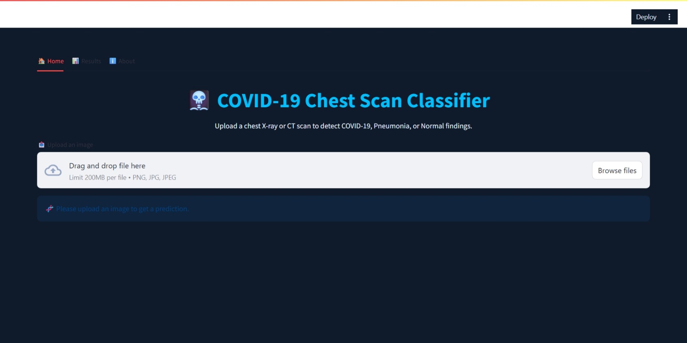

# 🩻 COVID-19 Chest X-ray Classifier

A deep learning web app that classifies chest X-ray or CT scan images into:
- 🦠 **COVID-19 Positive**
- ✅ **Normal**
- 🤒 **Viral Pneumonia**

This project uses a **Convolutional Neural Network (CNN)** built with **TensorFlow** and **Keras**, wrapped in a professional **Streamlit** UI.

---

## 🔍 Preview



---

## 🧠 How It Works

1. Upload a chest X-ray or CT scan (`.png`, `.jpg`, `.jpeg`)
2. The image is resized to `224x224` and normalized
3. A trained CNN model predicts one of three classes:
   - COVID-19 Positive
   - Normal
   - Viral Pneumonia
4. The app displays the result and the confidence percentage, along with a horizontal bar chart

---

## 🧪 Model Details

- **Input shape**: 224x224x3 RGB
- **Framework**: TensorFlow + Keras
- **Model type**: CNN (Convolutional Neural Network)
- **Output**: Softmax layer with 3 classes
- **Dataset**: [COVID-19 Radiography Database](https://www.kaggle.com/datasets/tawsifurrahman/covid19-radiography-database)

---

## 🛠️ Tech Stack

- **Frontend**: Streamlit
- **Backend/Model**: TensorFlow, Keras
- **Visualization**: Matplotlib
- **Image Processing**: Pillow (PIL), NumPy

---

## 📂 Project Structure

covid19-cnn-classifier/
│
├── app.py
├── covid19_cnn_model.h5
├── requirements.txt
├── runtime.txt
├── packages.txt
├── README.md
├── .gitignore
├── app_preview.png
---

## 📦 Installation & Run Locally

```bash
# Clone the repo
git clone https://github.com/Ziad-el3shry/covid19-cnn-classifier.git
cd covid19-cnn-classifier

# Create virtual environment (optional but recommended)
python -m venv venv
source venv/bin/activate  # or venv\\Scripts\\activate on Windows

# Install dependencies
pip install -r requirements.txt

# Run the app
streamlit run app.py
```
## 💡 Features

- 📤 Upload image interface  
- 🧠 Real-time deep learning prediction  
- 📊 Confidence visualization  
- 🎨 Dark-themed professional UI  
- ℹ️ About tab with project details

---

## ⚠️ Disclaimer

This app is for **educational and research purposes only**.  
It is **not a certified medical diagnostic tool** and should not be used for clinical decisions.

---

## 👨‍💻 Developed by

**Ziad Attia**  
📧 Email: ziadel3shry123@gmail.com  
🔗 LinkedIn: [Ziad Attia](https://www.linkedin.com/in/ziad-attia-4b1843241/)
